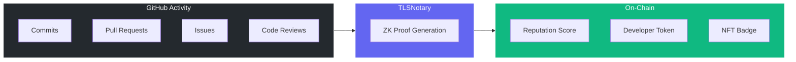
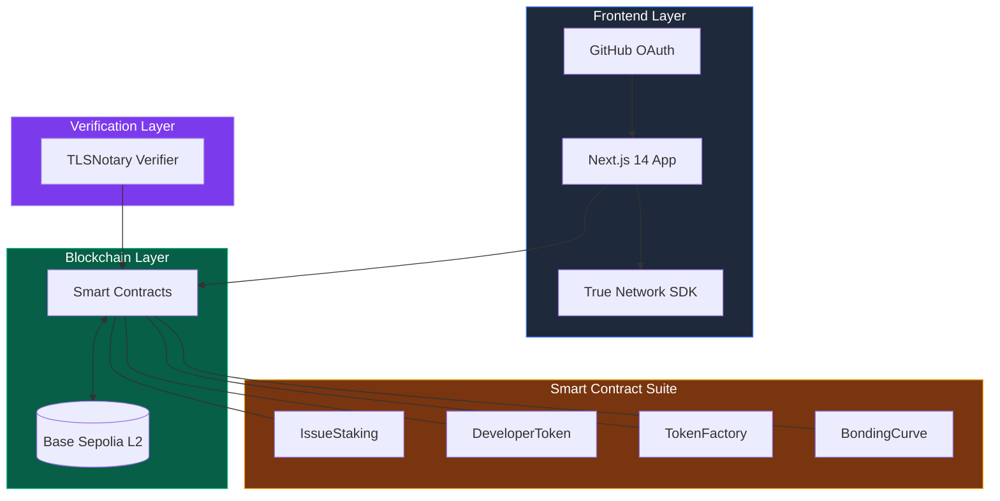
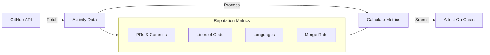
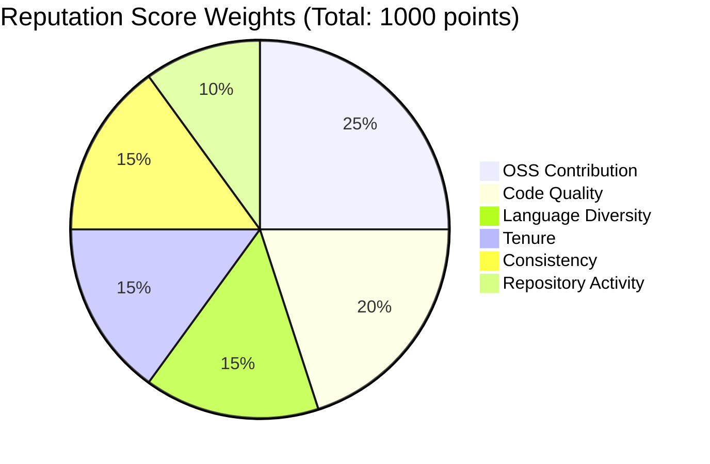
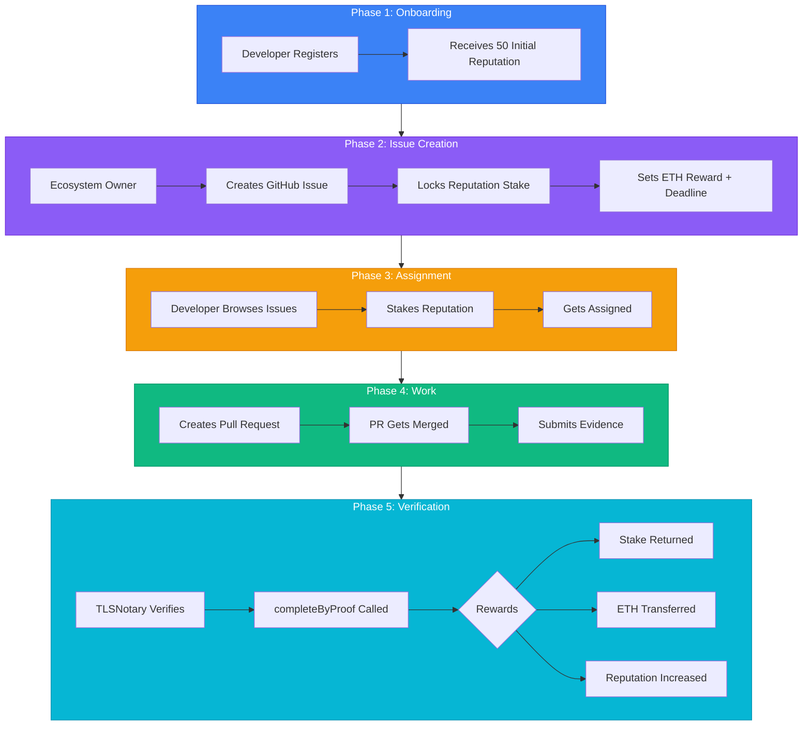
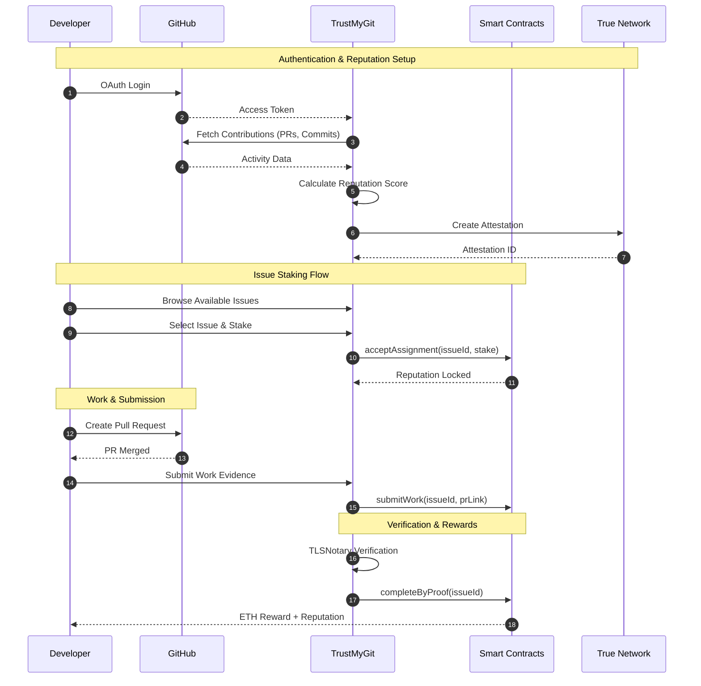
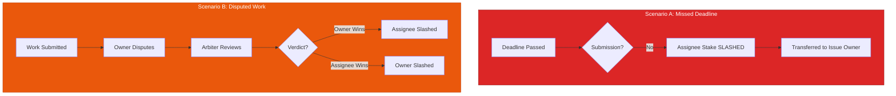
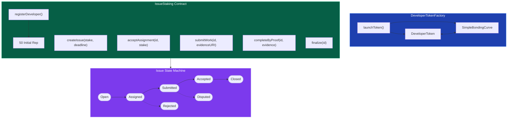
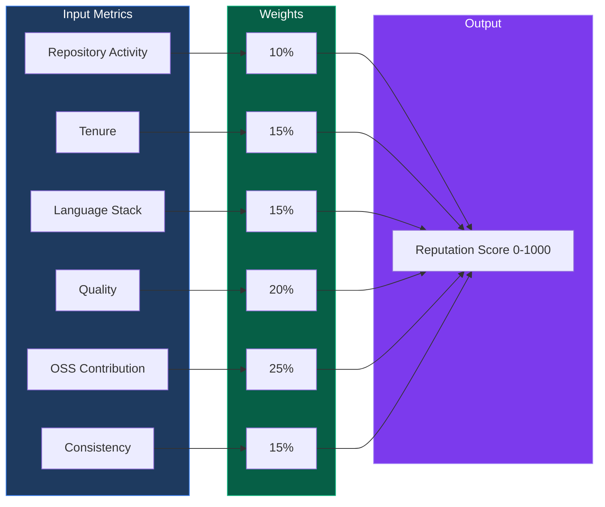

<div align="center">
  
  <!-- Add your logo to assets/logo.png -->
  
  
  # DevCred
  
  ### *Decentralized Developer Reputation & Staking Protocol*

[](https://nextjs.org/)
[](https://soliditylang.org/)
[](https://base.org/)
[](https://truenetwork.io/)
[](https://opensource.org/licenses/MIT)

  <p align="center">
    <strong>Transforming GitHub contributions into verifiable on-chain reputation</strong>
  </p>

[Live Demo](https://trustmygit.vercel.app) | [Documentation](#documentation) | [Quick Start](#quick-start) | [How It Works](#how-it-works)

</div>

---

## Table of Contents

- [Overview](#overview)
- [Key Features](#key-features)
- [Architecture](#architecture)
- [How It Works](#how-it-works)
- [Smart Contracts](#smart-contracts)
- [Tech Stack](#tech-stack)
- [Quick Start](#quick-start)
- [Project Structure](#project-structure)
- [API Reference](#api-reference)
- [Contributing](#contributing)
- [License](#license)

---

## Overview

**DevCred** is a decentralized protocol that bridges the gap between GitHub contributions and blockchain-based reputation systems. It enables developers to:

- Build **verifiable, on-chain reputation** from real GitHub activity
- **Stake reputation** on issues and earn rewards for completed work
- **Tokenize developer reputation** with bonding curve economics
- **Verify contributions** using TLSNotary cryptographic proofs



---

## Key Features

<table>
<tr>
<td width="50%">

### _Reputation System_

- **6 Key Metrics**: Repository activity, tenure, language diversity, code quality, OSS contributions, consistency
- **Per-Organization Scores**: Track reputation across multiple ecosystems
- **On-Chain Attestations**: True Network powered verifiable credentials

</td>
<td width="50%">

### _Issue Staking_

- **Skin-in-the-Game**: Stake reputation to claim issues
- **Automated Rewards**: ETH + reputation on successful completion
- **Slashing Mechanism**: Incentivize quality and timely delivery

</td>
</tr>
<tr>
<td width="50%">

### _Developer Tokens_

- **Personal Tokens**: Launch tokens backed by your reputation
- **Bonding Curves**: Fair price discovery with GDA mechanics
- **Liquidity Mining**: Trade developer tokens on-chain

</td>
<td width="50%">

### _TLSNotary Verification_

- **Cryptographic Proofs**: Verify PR merges without trusting a server
- **Zero-Knowledge Ready**: Privacy-preserving contribution proofs
- **Tamper-Proof**: Immutable verification records

</td>
</tr>
</table>

---

## Architecture

### System Overview



### Data Flow



#### Reputation Score Formula



---

## How It Works

### Issue Staking Flow



### Sequence Diagram



### Slashing Mechanics



---

## Smart Contracts

### Contract Addresses (Base Sepolia)

| Contract           | Address                                      | Description                  |
| ------------------ | -------------------------------------------- | ---------------------------- |
| **DevWorkFactory** | `0x7BE18dEe46C130102aa44572B2a4B8788DB0C40B` | Factory for developer tokens |
| **IssueStaking**   | _Deployed per ecosystem_                     | Issue staking and rewards    |

### Contract Architecture



### Reputation Scoring Algorithm

> **Formula:** `Final Score = Σ (Metric × Weight)` → Range: **0-1000**



---

## Tech Stack

<table>
<tr>
<td align="center" width="96">

<br>Next.js 14
</td>
<td align="center" width="96">

<br>TypeScript
</td>
<td align="center" width="96">

<br>Tailwind CSS
</td>
<td align="center" width="96">

<br>Solidity
</td>
<td align="center" width="96">

<br>GitHub API
</td>
</tr>
</table>

| Category            | Technology                   |
| ------------------- | ---------------------------- |
| **Framework**       | Next.js 14 (App Router)      |
| **Language**        | TypeScript 5.x               |
| **Styling**         | Tailwind CSS + shadcn/ui     |
| **Web3**            | wagmi + viem + RainbowKit    |
| **Smart Contracts** | Solidity 0.8.20 + Foundry    |
| **Blockchain**      | Base Sepolia (L2)            |
| **Reputation**      | True Network SDK             |
| **Charts**          | Recharts                     |
| **Testing**         | Jest + React Testing Library |

---

## Quick Start

### Prerequisites

- **Node.js** 18+
- **npm** or **pnpm**
- **MetaMask** or any EVM wallet
- **Base Sepolia ETH** ([Faucet](https://www.coinbase.com/faucets/base-ethereum-goerli-faucet))

### Installation

```bash
# 1. Clone the repository
git clone https://github.com/Divyanshhhhhhh-creator/DevCred.git
cd DevCred

# 2. Install dependencies
npm install

# 3. Set up environment variables
cp .env.example .env.local

# 4. Configure your .env.local
# GITHUB_CLIENT_ID=your_github_oauth_client_id
# GITHUB_CLIENT_SECRET=your_github_oauth_client_secret
# NEXT_PUBLIC_TRUE_NETWORK_API_KEY=your_true_network_key

# 5. Run the development server
npm run dev

# 6. Open http://localhost:3000
```

### Deploy Reputation Algorithm (Optional)

```bash
# Set up ACM (Algorithm Compute Module)
npm run acm:setup

# Prepare attestation helpers
npm run acm:prepare

# Compile to WebAssembly
npm run acm:compile

# Test with your wallet address
npm run acm:test <your_wallet_address>

# Deploy to True Network
npm run acm:deploy
```

### Build Smart Contracts (Optional)

```bash
cd contracts

# Install Foundry dependencies
forge install

# Build contracts
forge build

# Run tests
forge test

# Deploy (requires private key)
forge script script/Deploy.s.sol --rpc-url base-sepolia --broadcast
```

---

## Project Structure

```
DevCred/
├── app/                             # Next.js App Router
│   ├── api/                         # API Routes
│   │   ├── auth/github/             # GitHub OAuth endpoints
│   │   ├── ecosystem/issues/        # Ecosystem issues API
│   │   └── reputation/              # Reputation score APIs
│   ├── dev/[username]/              # Developer profile pages
│   ├── developer/                   # Developer dashboard & tokens
│   ├── ecosystem/                   # Ecosystem pages
│   ├── issues/                      # Issue browsing & staking
│   │   └── [issueId]/submit/        # PR submission flow
│   └── org/[orgName]/               # Organization pages
│
├── components/                      # React Components
│   ├── ui/                          # shadcn/ui base components
│   ├── AuthModal.tsx                # GitHub authentication
│   ├── StakeModal.tsx               # Issue staking modal
│   ├── StakedIssueCard.tsx          # Staked issue display
│   ├── TLSNotaryVerificationModal/  # TLSNotary verification
│   └── OrgReputationScores.tsx      # Reputation display
│
├── contracts/                       # Solidity Smart Contracts
│   └── src/
│       ├── IssueStaking.sol         # Core staking contract
│       ├── DeveloperToken.sol       # ERC20 dev tokens
│       ├── DeveloperTokenFactory.sol # Token factory
│       └── SimpleBondingCurve.sol   # GDA bonding curve
│
├── lib/                             # Utilities & Services
│   ├── contracts/                   # Contract ABIs & interactions
│   │   ├── abis.ts                  # Contract ABIs
│   │   ├── config.ts                # Network config
│   │   └── interactions.ts          # Contract functions
│   ├── trueNetwork/                 # True Network integration
│   │   ├── schemas.ts               # Attestation schemas
│   │   └── true.config.ts           # SDK configuration
│   ├── github.ts                    # GitHub API client
│   └── orgReputation.ts             # Reputation calculations
│
├── acm/                             # Algorithm Compute Module
│   ├── algorithm.ts                 # Reputation algorithm
│   ├── attestations.ts              # Attestation helpers
│   └── assembly/                    # AssemblyScript for WASM
│
└── Documentation
    ├── REPUTATION_ALGORITHM.md      # Algorithm setup guide
    ├── REPUTATION_IMPLEMENTATION.md # Implementation details
    └── QUICK_REFERENCE.md           # Quick reference
```

│ └── orgReputation.ts # Reputation calculations
│
├── 🧪 acm/ # Algorithm Compute Module
│ ├── algorithm.ts # Reputation algorithm
│ ├── attestations.ts # Attestation helpers
│ └── assembly/ # AssemblyScript for WASM
│
└── 📄 Documentation
├── REPUTATION_ALGORITHM.md # Algorithm setup guide
├── REPUTATION_IMPLEMENTATION.md # Implementation details
└── QUICK_REFERENCE.md # Quick reference

````

---

## API Reference

### Reputation Endpoints

#### Get Reputation Score

```http
GET /api/reputation/score?address={wallet}&algorithmId={id}
````

**Response:**

```json
{
  "success": true,
  "walletAddress": "0x742d35Cc6634C0532925a3b844Bc9e7595f0bEb",
  "algorithmId": 158,
  "overallScore": 782,
  "organizations": [
    {
      "orgName": "microsoft",
      "score": 87,
      "metrics": {
        "repoActivity": 15,
        "tenure": 22,
        "languageStack": 18,
        "quality": 19,
        "ossContribution": 8,
        "consistency": 5
      }
    }
  ]
}
```

#### Create Attestation

```http
POST /api/reputation/attest
Content-Type: application/json

{
  "walletAddress": "0x...",
  "githubUsername": "developer",
  "orgName": "organization"
}
```

### Issue Endpoints

#### Get Ecosystem Issues

```http
GET /api/ecosystem/issues?ecosystemId={id}
```

#### Check PR Status

```http
GET /api/github/pr/status?owner={owner}&repo={repo}&prNumber={number}
```

---

## Testing

```bash
# Run all tests
npm run test

# Run tests in watch mode
npm run test:watch

# Run with coverage report
npm run test:coverage

# Run contract tests
cd contracts && forge test -vvv
```

---

## Roadmap

- [x] GitHub OAuth Integration
- [x] On-Chain Reputation Attestations (True Network)
- [x] Issue Staking Smart Contracts
- [x] Developer Token Factory
- [x] Bonding Curve Mechanics
- [ ] TLSNotary Integration (Production)
- [ ] zkProofs for Contribution Verification
- [ ] Multi-chain Deployment
- [ ] DAO Governance for Disputes
- [ ] Mobile App

---

## 👥 Contributors

### **Arjun Madhav**
**1️⃣ System Design & Architecture**
* Define problem statement & scope
* Design overall system architecture
* Decide reputation metrics & weights
* Choose blockchain + wallet stack
* Design GitHub → on-chain data flow
* Security & trust assumptions
* Documentation of architecture

### **Ishan Aditya**
**2️⃣ Frontend (Next.js / React)**
* Project setup (Next.js, Tailwind, UI lib)
* GitHub OAuth integration
* Wallet connection (MetaMask / Wagmi)
* User profile page
* Reputation visualization UI
* Issue staking UI
* Token balance display
* Transaction status handling
* Error & loading states
* Responsive layout
* UI polish & UX improvements
* Frontend env & config handling

### **Divyansh Shukla**
**3️⃣ Smart Contracts**
* Contract architecture design
* Developer token contract
* Token factory contract
* Issue staking contract
* Bonding curve logic
* Reward distribution logic
* Access control & modifiers
* Contract testing
* Gas optimization
* Deployment scripts
* Contract documentation

### **Tarun Kumar**
**4️⃣ Backend & Reputation Engine**
* GitHub API integration
* Fetch PRs, commits, issues
* Reputation scoring algorithm
* Data normalization & weighting
* TLSNotary / verification logic
* Backend API routes
* Blockchain interaction layer
* Attestation generation
* Error handling & retries
* Backend configuration
* Backend documentation

---

## Contributing

We welcome contributions! Please see our [Contributing Guide](CONTRIBUTING.md) for details.

1. Fork the repository
2. Create your feature branch (`git checkout -b feature/amazing-feature`)
3. Commit your changes (`git commit -m 'Add amazing feature'`)
4. Push to the branch (`git push origin feature/amazing-feature`)
5. Open a Pull Request

---

## License

This project is licensed under the MIT License - see the [LICENSE](LICENSE) file for details.

---

## Acknowledgments

- [True Network](https://truenetwork.io/) - On-chain reputation infrastructure
- [Base](https://base.org/) - L2 blockchain
- [TLSNotary](https://tlsnotary.org/) - Cryptographic verification
- [shadcn/ui](https://ui.shadcn.com/) - UI components
- [Foundry](https://book.getfoundry.sh/) - Smart contract development

---

<div align="center">

### Built with love for the developer community

<a href="https://github.com/Rishikpulhani/TrustMyGit/stargazers">
  
</a>
<a href="https://github.com/Rishikpulhani/TrustMyGit/network/members">
  
</a>

**[Back to Top](#trustmygit)**

</div>
